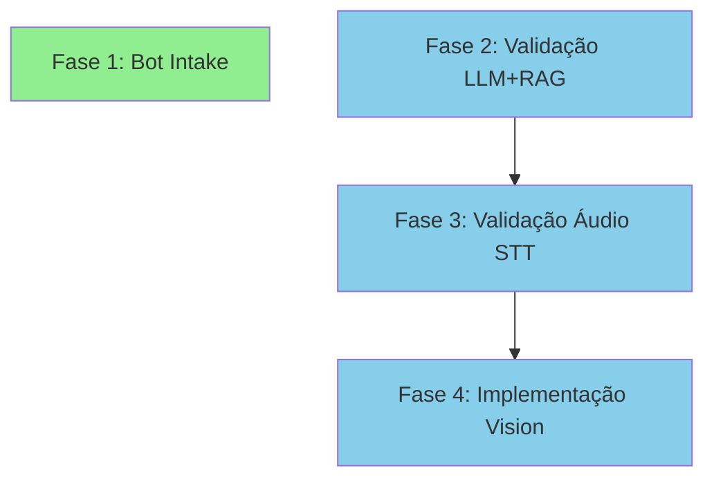

# Roadmap - OpenWA Platform

**Created:** 2026-08-26
**Focus:** End-to-End Flow Implementation & Validation

## Vision

OpenWA é uma plataforma completa de automação WhatsApp com inteligência artificial. O roadmap atual foca em **completar e validar os fluxos E2E principais** — cada fase entrega um ciclo completo testável de ponta a ponta.

## Success Criteria

- ✅ Bot de Intake funcional com workflow n8n completo
- ✅ Todos os fluxos multimodais (texto+LLM+RAG, áudio STT, imagem Vision) validados com testes E2E
- ✅ Zero gaps entre documentação e implementação
- ✅ Cobertura de testes E2E para casos de uso principais

---

## Phase 1: Bot de Intake E2E 🎯

**Goal:** Implementar o Bot de Intake completo — qualificação automatizada de leads com fluxo conversacional estruturado.

**Why this matters:** Feature core documentada (ARCHITECTURE.md L129-178) com schema de banco criado (`intake_staging.*`) mas sem implementação funcional. É um caso de uso principal do produto (PROJECT.md L22).

**Deliverables:**

- Controller e service para gerenciar intake sessions
- Workflow n8n que orquestra o fluxo conversacional
- Schema `intake_staging.*` integrado com lógica de negócio
- Testes E2E que validam: mensagem WhatsApp → coleta de dados → registro no banco → lead qualificado
- Documentação atualizada em GUIDES.md com exemplos de uso

**Success Criteria:**

- ✅ Cliente inicia conversa → bot faz perguntas estruturadas → dados salvos em `intake_staging.*`
- ✅ Lead exportável para CRM via webhook ou API
- ✅ Teste E2E automatizado que percorre o ciclo completo
- ✅ Workflow n8n importável e configurável

**Dependencies:** Nenhuma (infraestrutura já existe)

**Effort:** ~3-5 dias (controller + service + workflow + testes)

**Plans:** 4/4 plans executed (3 waves)

- [x] 01-01-PLAN.md — Tracer E2E: entidade IntakeLead + service + controller + registro nas conexões 'data' (Wave 1)
- [x] 01-02-PLAN.md — Fluxo conversacional estruturado + exportação do lead qualificado (Wave 2)
- [x] 01-03-PLAN.md — Workflow n8n Whatsapp-Intake-Bot.json orquestrando ingest→reply (Wave 2)
- [x] 01-04-PLAN.md — Teste E2E do ciclo completo + atualização de documentação (Wave 3)

---

## Phase 2: Validação E2E Texto+LLM+RAG 🎯

**Goal:** Criar teste E2E automatizado que valida o fluxo completo: WhatsApp → n8n → RAG (pgvector) → LLM → resposta contextualizada.

**Why this matters:** Backend completo existe (knowledge base, Redis memory, integration fabric, 10 workflows n8n), mas sem teste E2E que prove que o ciclo inteiro funciona. Claim "sistema completo de automação WhatsApp com IA" (README L3) não validado.

**Deliverables:**

- Teste E2E automatizado usando workflow n8n existente
- Suite de casos de teste: busca exata KB, busca fuzzy, fallback sem contexto
- Validação de latência (<3s end-to-end)
- Métricas de qualidade: taxa de acerto RAG, relevância de respostas
- CI/CD pipeline para rodar testes em PRs

**Success Criteria:**

- ✅ Teste simula mensagem WhatsApp → valida resposta do LLM contém informação correta da KB
- ✅ Cobertura: busca exata, busca semântica, caso sem match
- ✅ Latência medida e dentro do target (<3s)
- ✅ Testes rodam automaticamente no CI

**Dependencies:** Fase 1 (opcional — pode rodar em paralelo)

**Effort:** ~2-3 dias (setup de teste + casos + CI)

**Plans:** 4/4 plans executed (3 waves)

- [x] 02-01-PLAN.md — Tracer E2E: ciclo RAG completo com busca exata (Wave 1)
- [x] 02-02-PLAN.md — Expansão: fuzzy search + LLM-as-judge + fallback (Wave 2)
- [x] 02-03-PLAN.md — Métricas: latência (p50/p95/p99) + precision@k/recall@k (Wave 2)
- [x] 02-04-PLAN.md — CI/CD: GitHub Actions workflow para testes RAG (Wave 3)

---

## Phase 3: Validação E2E Áudio STT 🎯

**Goal:** Criar teste E2E automatizado que valida o fluxo: áudio WhatsApp → download → Groq Whisper transcrição → LLM → resposta texto.

**Why this matters:** Workflow n8n existe (`WhatsApp-Audio-Transcription.json`), GUIDES.md documenta (L382-479), mas sem teste E2E que valide o ciclo completo. Claim "multimodal (texto + áudio STT)" (README L47) não validado.

**Deliverables:**

- Teste E2E automatizado usando workflow n8n existente
- Suite de casos: áudio claro, áudio com ruído, múltiplos idiomas (PT/EN)
- Validação de acurácia da transcrição (>90%)
- Validação de latência (<5s para áudio de 10s)
- Fallback quando transcrição falha

**Success Criteria:**

- ✅ Teste simula áudio WhatsApp → valida transcrição correta → resposta LLM coerente
- ✅ Cobertura: áudio limpo, áudio ruidoso, idiomas PT/EN
- ✅ Acurácia transcrição medida (>90% em áudio limpo)
- ✅ Latência dentro do target (<5s para 10s de áudio)

**Dependencies:** Fase 2 (compartilha CI/CD pipeline)

**Effort:** ~2-3 dias (setup de teste + casos + métricas)

---

## Phase 4: Implementação E2E Vision 🎯

**Goal:** Criar workflow n8n + teste E2E para análise de imagens: imagem WhatsApp → download → GPT-4 Vision → LLM contextualizado → resposta sobre a imagem.

**Why this matters:** GUIDES.md documenta (L535-683), media controller existe, mas workflow n8n específico ausente. Claim "multimodal (imagem Vision)" (README L47) não implementado completamente.

**Deliverables:**

- Workflow n8n para processamento de imagem com Vision
- Teste E2E automatizado que valida o ciclo completo
- Suite de casos: foto produto, documento, screenshot, foto ambiente
- Validação de acurácia: descrição correta do conteúdo
- Documentação de custos (GPT-4 Vision não é free como Groq)

**Success Criteria:**

- ✅ Cliente envia imagem → bot analisa via Vision → responde sobre conteúdo
- ✅ Workflow n8n importável e configurável
- ✅ Cobertura: produto, documento, screenshot, ambiente
- ✅ Teste E2E automatizado
- ✅ Documentação de custos e rate limits

**Dependencies:** Fases 2 e 3 (compartilha padrões de teste)

**Effort:** ~3-4 dias (workflow + integration + testes + docs)

---

## Backlog & Future Phases

Features identificadas na reanálise mas fora do escopo atual:

### Telefonia VibeVoice (Fase 6 Futura)

- Integração com provedor VoIP
- Chamadas de voz com STT/TTS em tempo real
- Documentação já existe (GUIDES.md L365-534) como design de referência
- Status: PLANEJADO (aviso adicionado na documentação)

### Melhorias de Qualidade (Fase 5 Original)

- Aumentar cobertura testes unitários (meta: 80%)
- Testes de carga multi-sessão
- CI/CD pipeline completo GitHub Actions
- Status: Parcialmente coberto nas fases 2-4 (CI/CD para E2E)

### Advanced Features (Fase 6 Original)

- Long-term memory persistente (além de Redis)
- Dashboard analytics avançado
- Multi-tenant support
- API pública com rate limiting por tenant

### Enterprise & Scale (Fase 7 Original)

- Horizontal scaling (multi-replica + load balancer)
- Session affinity e distributed state
- Multi-region deployment
- High availability setup

---

## Dependencies

**Fase 1** pode rodar em paralelo com as outras (independente).
**Fases 2-4** sequenciais para reutilizar patterns de teste.

---

## Milestones

| Milestone | Fases | Entrega | Status |
|-----------|-------|---------|--------|
| **M1: Core E2E Validated** | 1-2 | Bot Intake funcional + LLM+RAG testado | 🎯 Current |
| **M2: Multimodal Complete** | 3-4 | Áudio STT + Vision testados e2e | 📋 Next |
| **M3: Production Hardening** | Backlog | Telefonia, scaling, multi-tenant | 📋 Future |

---

## Evolution Rules

Este roadmap foca nos **4 fluxos E2E prioritários** identificados na reanálise (2026-08-26).

**Após cada fase:**

1. Atualizar traceability em REQUIREMENTS.md
2. Marcar requirements como Complete
3. Atualizar PROJECT.md com decisões arquiteturais

**Após milestone M2 (todas fases completas):**

1. Auditar claims do README — tudo validado?
2. Atualizar documentação com exemplos reais dos testes
3. Planejar próximo milestone (backlog ou novo foco)

**Critério de "fase completa":**

- Todos deliverables entregues
- Todos success criteria ✅
- Teste E2E passando no CI
- Documentação atualizada

---

## Histórico de Fases Anteriores

### Fase 1-4: MVP até AI & Intelligence ✅ COMPLETAS

- MVP Foundation (API REST, single session, webhooks)
- Production Features (multi-session, dashboard, auth, monitoring)
- AI & Intelligence (LLM, multimodal, RAG, n8n)
- Documentation & Quality (consolidação de 50+ docs → 5 temáticos)

**Status:** Implementado e documentado. Ver versão anterior do ROADMAP.md em docs/archive/ para detalhes históricos.

---

*Roadmap criado: 2026-08-26 após reanálise de objetivos focada em fluxos E2E*
*Última atualização: 2026-08-26*
