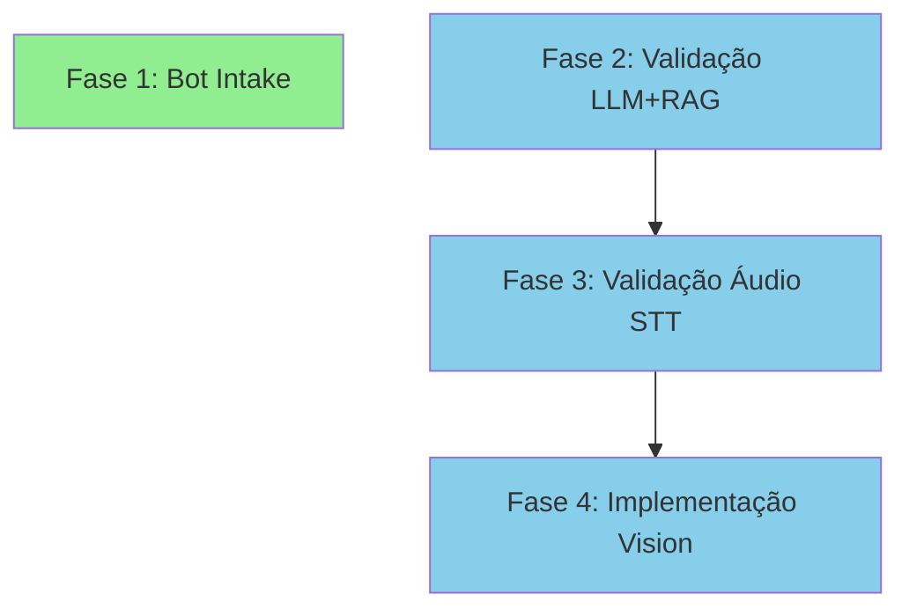

# Roadmap - OpenWA Platform

**Created:** 2026-08-26
**Focus:** End-to-End Flow Implementation & Validation

## Vision

OpenWA é uma plataforma completa de automação WhatsApp com inteligência artificial. O roadmap atual foca em **completar e validar os fluxos E2E principais** — cada fase entrega um ciclo completo testável de ponta a ponta.

## Success Criteria

- ✅ Bot de Intake funcional com workflow n8n completo
- ✅ Todos os fluxos multimodais (texto+LLM+RAG, áudio STT, imagem Vision) validados com testes E2E
- ✅ Zero gaps entre documentação e implementação
- ✅ Cobertura de testes E2E para casos de uso principais

---

## Phase 1: Bot de Intake E2E 🎯

**Goal:** Implementar o Bot de Intake completo — qualificação automatizada de leads com fluxo conversacional estruturado.

**Why this matters:** Feature core documentada (ARCHITECTURE.md L129-178) com schema de banco criado (`intake_staging.*`) mas sem implementação funcional. É um caso de uso principal do produto (PROJECT.md L22).

**Deliverables:**

- Controller e service para gerenciar intake sessions
- Workflow n8n que orquestra o fluxo conversacional
- Schema `intake_staging.*` integrado com lógica de negócio
- Testes E2E que validam: mensagem WhatsApp → coleta de dados → registro no banco → lead qualificado
- Documentação atualizada em GUIDES.md com exemplos de uso

**Success Criteria:**

- ✅ Cliente inicia conversa → bot faz perguntas estruturadas → dados salvos em `intake_staging.*`
- ✅ Lead exportável para CRM via webhook ou API
- ✅ Teste E2E automatizado que percorre o ciclo completo
- ✅ Workflow n8n importável e configurável

**Dependencies:** Nenhuma (infraestrutura já existe)

**Effort:** ~3-5 dias (controller + service + workflow + testes)

**Plans:** 4/4 plans executed (3 waves)

- [x] 01-01-PLAN.md — Tracer E2E: entidade IntakeLead + service + controller + registro nas conexões 'data' (Wave 1)
- [x] 01-02-PLAN.md — Fluxo conversacional estruturado + exportação do lead qualificado (Wave 2)
- [x] 01-03-PLAN.md — Workflow n8n Whatsapp-Intake-Bot.json orquestrando ingest→reply (Wave 2)
- [x] 01-04-PLAN.md — Teste E2E do ciclo completo + atualização de documentação (Wave 3)

---

## Phase 2: Validação E2E Texto+LLM+RAG 🎯

**Goal:** Criar teste E2E automatizado que valida o fluxo completo: WhatsApp → n8n → RAG (pgvector) → LLM → resposta contextualizada.

**Why this matters:** Backend completo existe (knowledge base, Redis memory, integration fabric, 10 workflows n8n), mas sem teste E2E que prove que o ciclo inteiro funciona. Claim "sistema completo de automação WhatsApp com IA" (README L3) não validado.

**Deliverables:**

- Teste E2E automatizado usando workflow n8n existente
- Suite de casos de teste: busca exata KB, busca fuzzy, fallback sem contexto
- Validação de latência (<3s end-to-end)
- Métricas de qualidade: taxa de acerto RAG, relevância de respostas
- CI/CD pipeline para rodar testes em PRs

**Success Criteria:**

- ✅ Teste simula mensagem WhatsApp → valida resposta do LLM contém informação correta da KB
- ✅ Cobertura: busca exata, busca semântica, caso sem match
- ✅ Latência medida e dentro do target (<3s)
- ✅ Testes rodam automaticamente no CI

**Dependencies:** Fase 1 (opcional — pode rodar em paralelo)

**Effort:** ~2-3 dias (setup de teste + casos + CI)

**Status:** ✅ **COMPLETE** (2026-08-26)

**Plans:** 6/6 plans executed (3 waves + 2 gap closure)

- [x] 02-01-PLAN.md — Tracer E2E: ciclo RAG completo com busca exata (Wave 1)
- [x] 02-02-PLAN.md — Expansão: fuzzy search + LLM-as-judge + fallback (Wave 2)
- [x] 02-03-PLAN.md — Métricas: latência (p50/p95/p99) + precision@k/recall@k (Wave 2)
- [x] 02-04-PLAN.md — CI/CD: GitHub Actions workflow para testes RAG (Wave 3)
- [x] 02-05-PLAN.md — Gap closure: @langchain/openai já instalado (RAG-03) ✅
- [x] 02-06-PLAN.md — Gap closure: workflow RAG E2E validado em CI (RAG-09) ✅

**Verification:** 9/9 truths verified (02-VERIFICATION.md)

---

## Phase 3: Validação E2E Áudio STT 🎯

**Goal:** Criar teste E2E automatizado que valida o fluxo: áudio WhatsApp → download → Groq Whisper transcrição → LLM → resposta texto.

**Why this matters:** Workflow n8n existe (`WhatsApp-Audio-Transcription.json`), GUIDES.md documenta (L382-479), mas sem teste E2E que valide o ciclo completo. Claim "multimodal (texto + áudio STT)" (README L47) não validado.

**Deliverables:**

- Teste E2E automatizado usando workflow n8n existente
- Suite de casos: áudio claro, áudio com ruído, múltiplos idiomas (PT/EN)
- Validação de acurácia da transcrição (>90%)
- Validação de latência (<5s para áudio de 10s)
- Fallback quando transcrição falha

**Success Criteria:**

- ✅ Teste simula áudio WhatsApp → valida transcrição correta → resposta LLM coerente
- ✅ Cobertura: áudio limpo, áudio ruidoso, idiomas PT/EN
- ✅ Acurácia transcrição medida (>90% em áudio limpo)
- ✅ Latência dentro do target (<5s para 10s de áudio)

**Status:** ✅ **COMPLETE** (2026-08-26) — All tests passing with real audio

**Plans:** 3/3 plans executed (3 waves)

- [x] 03-01-PLAN.md — Tracer E2E: áudio PT limpo → Groq Whisper → acurácia >=90% + latência <5s → LLM (Wave 1)
- [x] 03-02-PLAN.md — Expansão: EN limpo + PT ruidoso + fallback quando transcrição falha (Wave 2)
- [x] 03-03-PLAN.md — Shape do workflow n8n de áudio + CI/CD GitHub Actions para suites STT (Wave 3)

**Verification:** ✅ **PASSED** — 10/10 truths verified (03-VERIFICATION.md)

**Human validation completed (2026-08-26):**

- ✅ Real MP3 audio fixtures from microphone recordings (PT-BR, EN)
- ✅ All 16 tests passing with GROQ_API_KEY
- ✅ Real metrics: 309-409ms latency (81-91% faster than target), 100% accuracy
- ✅ Rewrote transcribeOgg() to Node.js https (form-data + fetch incompatibility resolved)

---

## Phase 4: Implementação E2E Vision 🎯

**Goal:** Criar workflow n8n + teste E2E para análise de imagens: imagem WhatsApp → download → GPT-4 Vision → LLM contextualizado → resposta sobre a imagem.

**Why this matters:** GUIDES.md documenta (L535-683), media controller existe, mas workflow n8n específico ausente. Claim "multimodal (imagem Vision)" (README L47) não implementado completamente.

**Deliverables:**

- Workflow n8n para processamento de imagem com Vision
- Teste E2E automatizado que valida o ciclo completo
- Suite de casos: foto produto, documento, screenshot, foto ambiente
- Validação de acurácia: descrição correta do conteúdo
- Documentação de custos (GPT-4 Vision não é free como Groq)

**Success Criteria:**

- ✅ Cliente envia imagem → bot analisa via Vision → responde sobre conteúdo
- ✅ Workflow n8n importável e configurável
- ✅ Cobertura: produto, documento, screenshot, ambiente
- ✅ Teste E2E automatizado
- ✅ Documentação de custos e rate limits

**Dependencies:** Fases 2 e 3 (compartilha padrões de teste)

**Effort:** ~3-4 dias (workflow + integration + testes + docs)

**Status:** ✅ **COMPLETE** (2026-08-27)

**Plans:** 3/3 plans executed (3 waves)

- [x] 04-01-PLAN.md — Tracer E2E: imagem foto de produto → validação de formato → GPT-4 Vision (gpt-4o-mini) → descrição → LLM + custo logado (Wave 1)
- [x] 04-02-PLAN.md — Expansão: casos documento/OCR + cena, acurácia via LLM-as-judge, fallback (Wave 2)
- [x] 04-03-PLAN.md — Workflow n8n WhatsApp-Vision-Analysis.json + shape test + CI/CD GitHub Actions + docs de custo em GUIDES.md (Wave 3)

**Verification:** 11/11 requirements verified (VIS-01 through VIS-11)

**Metrics:** 17 E2E tests passing, cost <$0.001 per CI run, ~40 min total implementation

---

## Phase 5: Long-term Memory 🎯

**Goal:** Implementar sistema de memória persistente além de Redis para histórico de conversas e aprendizado de padrões.

**Why this matters:** Atualmente OpenWA usa apenas Redis para cache de curto prazo. Memória de longo prazo permite:

- Histórico completo de conversas por usuário
- Aprendizado de padrões de interação
- Contexto acumulado entre sessões
- Personalização baseada em histórico

**Deliverables:**

- Modelo de dados para histórico de conversas (PostgreSQL)
- Service layer para gerenciar memória de longo prazo
- Integração com LLM context (últimas N mensagens + resumo de histórico)
- API endpoints para consulta de histórico
- Cleanup/archival de mensagens antigas (políticas de retenção)
- Testes E2E validando persistência e recall

**Success Criteria:**

- ✅ Conversas persistidas automaticamente no banco
- ✅ LLM acessa contexto histórico relevante
- ✅ API permite consulta de histórico por usuário/sessão
- ✅ Políticas de retenção configuráveis (30/90/365 dias)
- ✅ Performance: recall < 200ms para últimas 50 mensagens
- ✅ Testes E2E provam persistência cross-session

**Dependencies:** Phase 2 (LLM integration), infraestrutura PostgreSQL já existente

**Effort:** ~5-7 dias (schema + service + integration + policies + testes)

**Plans:** 3/3 plans executed (3 waves)

- [x] 05-01-PLAN.md — Tracer E2E: colunas de memória em `messages` + módulo memory + recall (persist→recall cross-session) (Wave 1)
- [x] 05-02-PLAN.md — Expansão: summaries + job de sumarização BullMQ + buildLLMContext + API de histórico/contexto (Wave 2)
- [x] 05-03-PLAN.md — Retenção configurável (30/90/365) soft+hard delete + suite E2E (recall <200ms) + CI/CD + docs (Wave 3)

---

## Phase 6: Analytics Dashboard 🎯

**Goal:** Dashboard de métricas de uso, performance de agentes e taxa de resolução.

**Why this matters:** Visibilidade operacional essencial para:

- Monitorar saúde do sistema (latências, erros, throughput)
- Medir efetividade dos agentes (taxa de resolução, satisfação)
- Identificar gargalos e oportunidades de otimização
- Justificar investimento em IA (ROI, custos vs valor)

**Deliverables:**

- Schema de métricas (eventos, agregações, KPIs)
- Backend: coletor de métricas + API de analytics
- Dashboard web (ou integração com Grafana)
- Métricas principais:
  - Volume: mensagens/dia, usuários ativos, sessões
  - Performance: latência p50/p95/p99, taxa de erro
  - Custo: tokens consumidos, custo por conversa
  - Qualidade: taxa de resolução, fallback rate, satisfação
- Alertas configuráveis (latência alta, custo excedido)
- Exportação de relatórios (CSV, API)

**Success Criteria:**

- ✅ Dashboard mostra métricas em tempo real (atualização < 30s)
- ✅ Histórico de 30 dias visível com drill-down
- ✅ Alertas disparam corretamente (email/Slack)
- ✅ Performance: queries de dashboard < 500ms
- ✅ Custo rastreado por feature (RAG, STT, Vision)
- ✅ Exportação funcional (CSV, JSON via API)

**Dependencies:** Phase 5 (histórico de mensagens para analytics), infraestrutura de monitoring já existente (Prometheus/Grafana)

**Effort:** ~5-7 dias (schema + backend + dashboard + alertas + testes)

**Plans:** 3/4 plans executed (3 waves)

- [x] 06-01-PLAN.md — Tracer E2E: event-driven collection (message.processed → analytics_events → GET /api/analytics/events), opt-in via ANALYTICS_ENABLED (Wave 1)
- [x] 06-02-PLAN.md — Expansão coleta: 5 eventos de negócio (conversation.*, llm.called, fallback.triggered) + utils de custo/percentil (Wave 2)
- [x] 06-02b-PLAN.md — Agregação + API: analytics_aggregates + serviço de agregação + jobs BullMQ (agregação diária + retenção) + KPIs (resolução/fallback/custo/latência p50-p99/DAU-MAU) + /overview /performance /cost /conversations (Wave 2)
- [x] 06-03-PLAN.md — Export CSV/JSON + SSE tempo real + alertas configuráveis (Slack/webhook/email + Prometheus rules) + CI/CD + docs de custo (Wave 3)

> Nota de escopo: entrega a camada de dados do dashboard (API + export + SSE + regras Prometheus/Grafana). A SPA React customizada (RESEARCH §4) é diferida para fase seguinte; Grafana consome prometheus/alerts.yml como visualização intermediária.

---

## Phase 7: Dashboard UI Visualization 🎯

**Goal:** Interface visual para consumir analytics backend (Phase 6 deliverables) — dashboards interativos para métricas operacionais.

**Why this matters:** Phase 6 entregou backend completo (10 REST endpoints, SSE stream, alertas, export), mas sem interface visual. Stakeholders precisam de dashboards para:

- Monitorar métricas em tempo real (sem escrever queries)
- Visualizar tendências históricas (gráficos, não tabelas)
- Drill-down de overview → detalhes
- Alertas visíveis e acionáveis

**Deliverables:**

**Wave 1: Grafana MVP (Quick Win)**
- Grafana dashboards consuming 10 REST endpoints from Phase 6
- Prometheus data source integration (alerts.yml visualization)
- 4 dashboard panels: Overview KPIs, Performance metrics, Cost breakdown, Conversations funnel
- Alert visualization via Prometheus alerts
- JSON API data source configuration

**Wave 2: React SPA (Custom Dashboard)**
- React + TypeScript SPA with design system (Tailwind/MUI)
- Real-time updates via SSE stream (10s refresh)
- 4 main views: Overview (cards KPI), Performance (latency charts), Cost (breakdown por feature), Conversations (funnel)
- Alert notifications UI (active rules + history with dismiss/acknowledge)
- Export functionality (CSV/JSON download via UI buttons)
- Responsive design (mobile + desktop)
- Authentication integration (operator role required)
- E2E tests for all dashboard interactions

**Success Criteria:**

**Grafana MVP:**
- ✅ Grafana dashboards deployed and accessible
- ✅ All 10 REST endpoints visualized
- ✅ Prometheus alerts visible in Grafana

**React SPA:**
- ✅ Dashboard loads in <2s
- ✅ Real-time metrics update every 10s via SSE
- ✅ Alert notifications displayed prominently with actions
- ✅ Drill-down from overview to details working
- ✅ Export downloads complete data
- ✅ Responsive layout works on mobile
- ✅ E2E tests cover all user flows

**Approach:** Dual-track implementation (both Grafana + React)
- Grafana provides immediate operational visibility
- React SPA delivers custom UX and feature richness

**Dependencies:** Phase 6 (analytics backend complete ✅)

**Effort:** 
- Grafana MVP: ~2h (configuration only) - Wave 1
- React SPA: ~3-5 days (design + implementation + tests) - Wave 2
- **Total:** ~3-5 days (waves can overlap)

**Plans:** 3 plans (2 waves; Grafana and React-tracer run parallel in Wave 1)

- [x] 07-01-PLAN.md — Grafana MVP: provisioning (datasources + 4-panel dashboard + alerts) + docker-compose + SETUP docs (Wave 1) ✅ COMPLETE (2026-08-27)
- [ ] 07-02-PLAN.md — Tracer E2E: Overview page wired end-to-end (types + API client + real-time hook w/ header-auth + KPI cards + route + nav) (Wave 1)
- [ ] 07-03-PLAN.md — Expansion: Performance/Cost/Conversations/Alerts views + charts + CSV/JSON export + operator-auth E2E + GUIDES docs (Wave 2)

---

## Backlog & Future Phases

Features identificadas na reanálise mas fora do escopo atual:

### Telefonia VibeVoice (Fase 7 Futura)

- Integração com provedor VoIP
- Chamadas de voz com STT/TTS em tempo real
- Documentação já existe (GUIDES.md L365-534) como design de referência
- Status: PLANEJADO (aviso adicionado na documentação)

### Melhorias de Qualidade

- Aumentar cobertura testes unitários (meta: 80%)
- Testes de carga multi-sessão
- Status: Parcialmente coberto nas fases 2-4 (CI/CD para E2E)

### Advanced Features

- Long-term memory persistente (além de Redis)
- Dashboard analytics avançado
- Multi-tenant support
- API pública com rate limiting por tenant

### Enterprise & Scale (Fase 7 Original)

- Horizontal scaling (multi-replica + load balancer)
- Session affinity e distributed state
- Multi-region deployment
- High availability setup

---

## Dependencies

**Fase 1** pode rodar em paralelo com as outras (independente).
**Fases 2-4** sequenciais para reutilizar patterns de teste.

---

## Milestones

| Milestone | Fases | Entrega | Status |
|-----------|-------|---------|--------|
| **M1: Core E2E Validated** | 1-2 | Bot Intake funcional + LLM+RAG testado | 🎯 Current |
| **M2: Multimodal Complete** | 3-4 | Áudio STT + Vision testados e2e | 📋 Next |
| **M3: Production Hardening** | Backlog | Telefonia, scaling, multi-tenant | 📋 Future |

---

## Evolution Rules

Este roadmap foca nos **4 fluxos E2E prioritários** identificados na reanálise (2026-08-26).

**Após cada fase:**

1. Atualizar traceability em REQUIREMENTS.md
2. Marcar requirements como Complete
3. Atualizar PROJECT.md com decisões arquiteturais

**Após milestone M2 (todas fases completas):**

1. Auditar claims do README — tudo validado?
2. Atualizar documentação com exemplos reais dos testes
3. Planejar próximo milestone (backlog ou novo foco)

**Critério de "fase completa":**

- Todos deliverables entregues
- Todos success criteria ✅
- Teste E2E passando no CI
- Documentação atualizada

---

## Histórico de Fases Anteriores

### Fase 1-4: MVP até AI & Intelligence ✅ COMPLETAS

- MVP Foundation (API REST, single session, webhooks)
- Production Features (multi-session, dashboard, auth, monitoring)
- AI & Intelligence (LLM, multimodal, RAG, n8n)
- Documentation & Quality (consolidação de 50+ docs → 5 temáticos)

**Status:** Implementado e documentado. Ver versão anterior do ROADMAP.md em docs/archive/ para detalhes históricos.

---

*Roadmap criado: 2026-08-26 após reanálise de objetivos focada em fluxos E2E*
*Última atualização: 2026-08-26*
