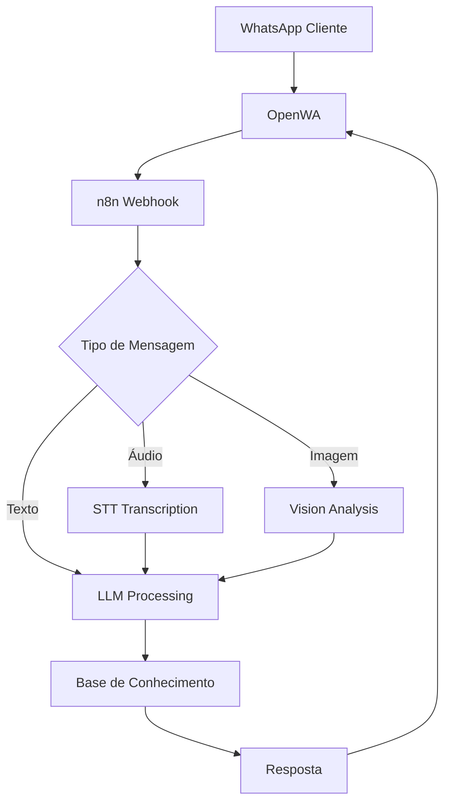

# Arquitetura OpenWA

Este documento consolida toda a arquitetura do sistema OpenWA - desde a estrutura global até os bots específicos.

## Índice
1. [Arquitetura Global](#arquitetura-global)
2. [Unified Bot](#unified-bot)
3. [Bot de Intake](#bot-de-intake)
4. [Análise de Gaps e Soluções](#análise-de-gaps)

---

## Arquitetura Global

### Stack Completa de Atendimento Multicanal

**Componentes:**
- **OpenWA** (WhatsApp Multi-Session)
- **n8n** (Automação e orquestração)
- **LLM Providers** (Groq, OpenAI)
- **PostgreSQL** (Persistência)
- **Redis** (Cache e filas)
- **Monitoring Stack** (Prometheus, Grafana, Loki)

### Fluxo de Comunicação



### Camadas de Segurança

1. **API Keys** - Autenticação OpenWA
2. **Rate Limiting** - Proteção contra abuse
3. **Validation** - Sanitização de inputs
4. **Encryption** - TLS para todas comunicações

### Performance e Escalabilidade

- **Horizontal Scaling**: n8n workers (2+ instâncias)
- **Queue System**: Redis BullMQ
- **Connection Pooling**: PostgreSQL (20 conexões)
- **Caching**: Redis (session, KB cache)
- **CDN**: Media files optimization

---

## Unified Bot

O **Unified Bot** é a arquitetura consolidada que unifica o processamento de mensagens de texto, áudio e imagem em um único fluxo.

### Características

- Single webhook endpoint para todas as mensagens
- Roteamento inteligente por tipo de mídia
- Processamento multimodal (texto + áudio + imagem)
- Knowledge Base integrada
- Memory/context management

### Estrutura do Workflow

```
[Webhook Trigger]
    ↓
[Message Type Router]
    ├─ Texto → [LLM Direct]
    ├─ Áudio → [STT] → [LLM]
    └─ Imagem → [Vision] → [LLM]
    ↓
[Knowledge Base Augmentation]
    ↓
[LLM Response Generation]
    ↓
[Response Formatter]
    ↓
[OpenWA Reply]
```

### Configuração de Nodes Críticos

**1. HTTP Webhook**
- Method: POST
- Path: `/webhook/whatsapp`
- Response: JSON

**2. Switch Node (Type Router)**
```javascript
// Audio check
{{ $json.messageType === 'audio' || $json.messageType === 'ptt' }}

// Image check
{{ $json.messageType === 'image' }}

// Text (default)
{{ $json.messageType === 'chat' || $json.messageType === 'text' }}
```

**3. LLM Node**
```javascript
Model: mixtral-8x7b-32768 (Groq)
Temperature: 0.7
Max Tokens: 1024
System Prompt: ver SYSTEM_PROMPT_INTAKE.md
```

### Versões de Arquivo

| Arquivo | Status | Descrição |
|---------|--------|-----------|
| `Whatsapp-Unified-Bot.json` | Base | Versão inicial |
| `Whatsapp-Unified-Bot-FIXED.json` | Stable | Correções de bugs |
| `Whatsapp-Unified-Multimodal.json` | Beta | Suporte multimodal |
| `Whatsapp-Unified-Multimodal-COMPLETE.json` | Production | Versão completa recomendada |
| `Whatsapp-Unified-Multimodal-ULTRA-COMPLETE.json` | Latest | Versão mais recente |

---

## Bot de Intake

> ⚠️ **STATUS: SCHEMA CRIADO, IMPLEMENTAÇÃO PENDENTE** — O schema de banco (`intake_staging.*`) existe mas 
> controller, workflow n8n e testes estão pendentes. Previsto para próxima fase do roadmap.

Bot especializado para **triagem e qualificação de leads** com coleta estruturada de informações.

### Funcionalidades

- Coleta de dados do cliente (nome, telefone, email)
- Qualificação de demanda
- Identificação de urgência
- Encaminhamento inteligente
- Integração com CRM

### Estrutura de Dados Coletados

```json
{
  "nome": "string",
  "telefone": "string",
  "email": "string",
  "empresa": "string",
  "cargo": "string",
  "demanda": "string",
  "urgencia": "baixa|media|alta",
  "origem": "whatsapp",
  "timestamp": "ISO8601"
}
```

### Fluxo de Conversação

1. **Saudação Inicial** - Apresentação do serviço
2. **Coleta de Nome** - Primeira informação
3. **Coleta de Contato** - Telefone e/ou email
4. **Identificação de Demanda** - "Como posso ajudar?"
5. **Qualificação** - Perguntas específicas baseadas na demanda
6. **Avaliação de Urgência** - Timeline do cliente
7. **Confirmação** - Resumo dos dados coletados
8. **Encaminhamento** - Próximos passos

### System Prompt

O system prompt completo está documentado em [`SYSTEM_PROMPT_INTAKE.md`](archive/SYSTEM_PROMPT_INTAKE.md).

**Instruções Principais:**
- Tom profissional mas amigável
- Perguntas objetivas
- Validação de inputs
- Respostas concisas
- Não inventar informações

---

## Análise de Gaps

### Gaps Identificados

#### 1. **Multimodalidade**
**Status:** ✅ Resolvido
- Implementado: Suporte a áudio (via STT) e imagem (via Vision)
- Workflow: `Whatsapp-Unified-Multimodal-COMPLETE.json`

#### 2. **Knowledge Base**
**Status:** ✅ Resolvido
- Implementado: Vector search no Supabase
- RAG pipeline integrado

#### 3. **Context/Memory**
**Status:** ⚠️ Parcial
- Redis para sessão curta
- Falta: long-term memory persistente

#### 4. **Monitoramento**
**Status:** ✅ Resolvido
- Prometheus + Grafana
- Loki para logs centralizados

#### 5. **Telefonia (Voz)**
**Status:** 🔴 Pendente
- Solução proposta: VibeVoice ou Twilio
- Aguardando decisão de implementação

### Próximos Passos

1. ✅ Consolidar documentação (este arquivo)
2. ⚠️ Implementar long-term memory
3. 🔴 Avaliar integração de telefonia
4. 🔴 Testes de carga e stress
5. 🔴 Documentação de API completa

---

## Referências

- [Setup Guide](SETUP.md)
- [Usage Guides](GUIDES.md)
- [Workflows](WORKFLOWS.md)
- [Troubleshooting](TROUBLESHOOTING.md)
- [Original Docs Archive](archive/)
