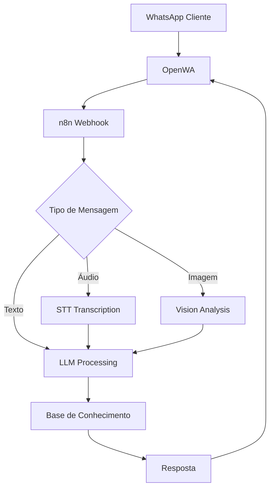

# Arquitetura OpenWA

Este documento consolida toda a arquitetura do sistema OpenWA - desde a estrutura global até os bots específicos.

## Índice
1. [Arquitetura Global](#arquitetura-global)
2. [Unified Bot](#unified-bot)
3. [Bot de Intake](#bot-de-intake)
4. [Análise de Gaps e Soluções](#análise-de-gaps)

---

## Arquitetura Global

### Stack Completa de Atendimento Multicanal

**Componentes:**
- **OpenWA** (WhatsApp Multi-Session)
- **n8n** (Automação e orquestração)
- **LLM Providers** (Groq, OpenAI)
- **PostgreSQL** (Persistência)
- **Redis** (Cache e filas)
- **Monitoring Stack** (Prometheus, Grafana, Loki)

### Fluxo de Comunicação



### Camadas de Segurança

1. **API Keys** - Autenticação OpenWA
2. **Rate Limiting** - Proteção contra abuse
3. **Validation** - Sanitização de inputs
4. **Encryption** - TLS para todas comunicações

### Performance e Escalabilidade

- **Horizontal Scaling**: n8n workers (2+ instâncias)
- **Queue System**: Redis BullMQ
- **Connection Pooling**: PostgreSQL (20 conexões)
- **Caching**: Redis (session, KB cache)
- **CDN**: Media files optimization

---

## Unified Bot

O **Unified Bot** é a arquitetura consolidada que unifica o processamento de mensagens de texto, áudio e imagem em um único fluxo.

### Características

- Single webhook endpoint para todas as mensagens
- Roteamento inteligente por tipo de mídia
- Processamento multimodal (texto + áudio + imagem)
- Knowledge Base integrada
- Memory/context management

### Estrutura do Workflow

```
[Webhook Trigger]
    ↓
[Message Type Router]
    ├─ Texto → [LLM Direct]
    ├─ Áudio → [STT] → [LLM]
    └─ Imagem → [Vision] → [LLM]
    ↓
[Knowledge Base Augmentation]
    ↓
[LLM Response Generation]
    ↓
[Response Formatter]
    ↓
[OpenWA Reply]
```

### Configuração de Nodes Críticos

**1. HTTP Webhook**
- Method: POST
- Path: `/webhook/whatsapp`
- Response: JSON

**2. Switch Node (Type Router)**
```javascript
// Audio check
{{ $json.messageType === 'audio' || $json.messageType === 'ptt' }}

// Image check
{{ $json.messageType === 'image' }}

// Text (default)
{{ $json.messageType === 'chat' || $json.messageType === 'text' }}
```

**3. LLM Node**
```javascript
Model: mixtral-8x7b-32768 (Groq)
Temperature: 0.7
Max Tokens: 1024
System Prompt: ver SYSTEM_PROMPT_INTAKE.md
```

### Versões de Arquivo

| Arquivo | Status | Descrição |
|---------|--------|-----------|
| `Whatsapp-Unified-Bot.json` | Base | Versão inicial |
| `Whatsapp-Unified-Bot-FIXED.json` | Stable | Correções de bugs |
| `Whatsapp-Unified-Multimodal.json` | Beta | Suporte multimodal |
| `Whatsapp-Unified-Multimodal-COMPLETE.json` | Production | Versão completa recomendada |
| `Whatsapp-Unified-Multimodal-ULTRA-COMPLETE.json` | Latest | Versão mais recente |

---

## Bot de Intake

> ✅ **STATUS: IMPLEMENTADO (Phase 1)** — Módulo `src/modules/intake` (controller + service + motor
> conversacional), workflow n8n `Whatsapp-Intake-Bot.json` e cobertura E2E do ciclo completo
> (`test/intake-e2e-cycle.e2e-spec.ts`) entregues. O schema de produção Postgres (`intake_staging.*`,
> migration 003) permanece o caminho Postgres; a entidade `IntakeLead` é o caminho cross-dialect
> (SQLite/Postgres) na conexão `data`.

Bot especializado para **triagem e qualificação de leads** com coleta estruturada de informações.

### Implementação

| Camada | Arquivo | Responsabilidade |
|--------|---------|------------------|
| Controller | `src/modules/intake/intake.controller.ts` | Rotas REST (`@RequireRole(OPERATOR)`) |
| Service | `src/modules/intake/intake.service.ts` | Persistência (conexão `data`), upsert por `chatId`, export SSRF-guarded |
| Motor de fluxo | `src/modules/intake/intake-flow.ts` | `advanceIntake` — state machine determinística (pure function) |
| Entidade | `src/modules/intake/entities/intake-lead.entity.ts` | `IntakeLead` cross-dialect (`intake_leads`) |
| Workflow n8n | `Whatsapp-Intake-Bot.json` | Orquestra WhatsApp → rotas de intake |
| E2E | `test/intake-e2e-cycle.e2e-spec.ts` | Ciclo completo: mensagem → coleta → banco → export |

Guia de uso das rotas e do import do workflow: ver [`GUIDES.md`](GUIDES.md#bot-de-intake).

### Rotas REST

- `POST /api/sessions/:sessionId/intake/messages` — ingere uma mensagem, avança o fluxo e retorna a próxima pergunta (`reply`, `step`, `completed`)
- `GET /api/sessions/:sessionId/intake/leads/:chatId` — lê o lead persistido
- `POST /api/sessions/:sessionId/intake/leads/:chatId/export` — exporta o lead qualificado (`completed`) para uma URL externa (409 se incompleto)

### Estrutura de Dados Coletados

Cinco campos nucleares coletados em ordem (espelham `intake_staging.leads`):

```json
{
  "fullName": "string",
  "phone": "string",
  "email": "string",
  "caseType": "string",
  "urgencyLevel": "normal|high|critical",
  "chatId": "string",
  "intakeStatus": "in_progress|completed",
  "intakeCompletedAt": "ISO8601"
}
```

### Fluxo de Conversação

A ordem canônica é determinada pelo primeiro campo vazio (`intake-flow.ts`):

1. **Nome** (`collect_name`) — "qual é o seu nome completo?"
2. **Telefone** (`collect_phone`) — "qual é o seu telefone para contato?"
3. **E-mail** (`collect_email`) — "qual é o seu e-mail?"
4. **Demanda** (`collect_demand`) — "descreva brevemente a sua demanda"
5. **Urgência** (`collect_urgency`) — "normal, alta ou crítica" (normalizado para `normal`/`high`/`critical`)
6. **Confirmação** (`completed`) — resumo dos dados; lead marcado `completed` e pronto para export

### Segurança

- Rotas exigem API key OPERATOR (`@RequireRole(ApiKeyRole.OPERATOR)`), sem `@Public`
- Body validado por `IngestIntakeMessageDto` (class-validator: whitelist + `MaxLength`)
- `urgencyLevel` validado no motor contra o domínio; input inválido não é gravado (repete a pergunta)
- Export reusa `postWebhookPayload` (SSRF guard do módulo webhook); só lead `completed` é exportável

---

## Análise de Gaps

### Gaps Identificados

#### 1. **Multimodalidade**
**Status:** ✅ Resolvido
- Implementado: Suporte a áudio (via STT) e imagem (via Vision)
- Workflow: `Whatsapp-Unified-Multimodal-COMPLETE.json`

#### 2. **Knowledge Base**
**Status:** ✅ Resolvido
- Implementado: Vector search no Supabase
- RAG pipeline integrado

#### 3. **Context/Memory**
**Status:** ⚠️ Parcial
- Redis para sessão curta
- Falta: long-term memory persistente

#### 4. **Monitoramento**
**Status:** ✅ Resolvido
- Prometheus + Grafana
- Loki para logs centralizados

#### 5. **Telefonia (Voz)**
**Status:** 🔴 Pendente
- Solução proposta: VibeVoice ou Twilio
- Aguardando decisão de implementação

### Próximos Passos

1. ✅ Consolidar documentação (este arquivo)
2. ⚠️ Implementar long-term memory
3. 🔴 Avaliar integração de telefonia
4. 🔴 Testes de carga e stress
5. 🔴 Documentação de API completa

---

## Referências

- [Setup Guide](SETUP.md)
- [Usage Guides](GUIDES.md)
- [Workflows](WORKFLOWS.md)
- [Troubleshooting](TROUBLESHOOTING.md)
- [Original Docs Archive](archive/)
